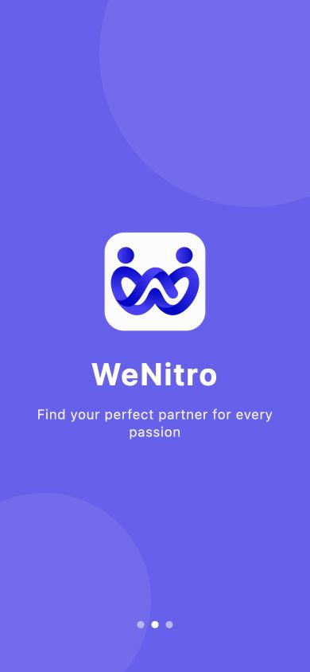
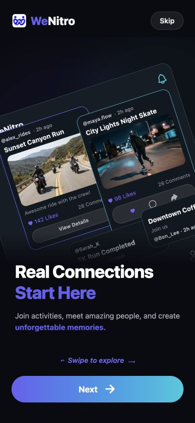
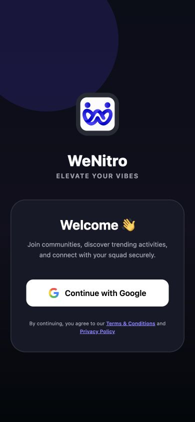
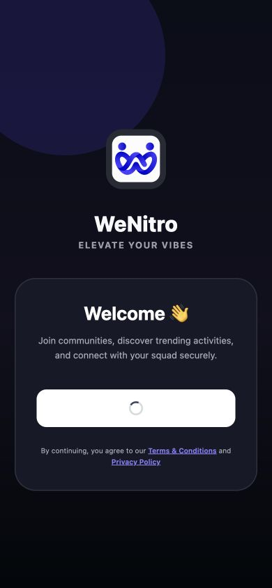
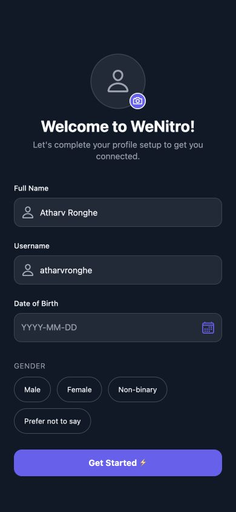
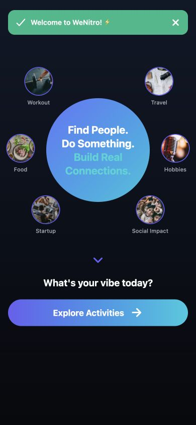

# WeNitro onboarding implementation and QA — 2026-09-08

Local implementation is ready for visual inspection. Google sign-in and new-profile persistence are **not verified end to end**. No deployment, commit, push, remote migration, account creation, payment, or social-data creation occurred in this run.

## Scope and references

Rebuilt only launch, the single evidenced marketing intro, Google Welcome, profile completion, first-time welcome, and authentication routing. The 25.7745-second recording defines the actual Google transition. Both complete recordings were reviewed as sequential extracted frames; all six still images were reviewed. The longer recording's other screens remain future reference.

See [reference analysis](onboarding-reference-analysis.md) for measured geometry, timing and evidence boundaries. Intro cards, text, buttons, navigation and forms are real React Native components. Only the original logo and individual photographic artwork interiors are images. The marketing card labels are static reference artwork, never feed fixtures or database records.

## Configuration and external blockers

- Correct configured project: `klyjzbisgycegkkacbjw`. Its public Auth settings endpoint returned HTTP 200. Google is disabled; email and phone remain enabled.
- The supplied Google Web client ID is configured in `.env.local`. Existing values were preserved. This ID is public; no Google secret is used in the frontend or required for its native ID-token exchange.
- Connected Supabase MCP project inspection and read-only SQL both return `MCP error -32600: You do not have permission to perform this action`. Live schema/security verification and authorized migrations could not run. No CLI or alternate management credential was used.
- `docs/sql/profile_onboarding_candidate.sql` and its rollback assertions are **unapplied/unrun candidates**. Verify the live schema, existing function names, grants, triggers, identity uniqueness and username collisions through the correct MCP before applying. Then regenerate database types and execute the assertions. New username availability/completion currently requires these RPCs; the UI fails safely if they are absent.
- Enable/configure Google's provider and accepted ID-token audiences in the correct Supabase project. Verify Google Cloud authorized JavaScript origins, consent/test-user settings, and the Android OAuth package/signing registration for the actual development build. See [Google setup](google-auth-setup.md).
- The actual web GIS button rendered and entered its disabled spinner state. The browser reported `FedCM get() rejects with NetworkError: Error retrieving a token.` It subsequently restored the button. No account was selected and no Google session was created.
- Native account chooser testing needs a custom Android development build containing the Google SDK. Expo Go cannot provide this module. Android SDK/emulator was available and the app launched in Expo Go; the custom build was not run (a local JDK was not available). Android Google signing registration remains unverified.

## Architecture and security

Native Google SDK → genuine Google ID token → isolated, nonpersistent Supabase token exchange → existing Supabase session → existing authenticated `tbl_users` bridge. Web uses Google's official GIS-rendered button and a random nonce, not a fabricated account picker. No client secret, service-role key or token logging was added.

An abortable 30-second deadline protects the token exchange. Cancellation and late responses cannot publish a session before its explicit commit boundary. Supabase's final `setSession` is awaited; it is not incorrectly advertised as atomically cancellable.

The current `onboarding_completed` field and previous grandfathering migration are reused. Existing completed users retain nullable DOB/gender. No blanket flag update or new identity table was added. No account is linked by display-name similarity.

Profile load precedes Feed fetch. Auth identity changes invalidate old requests and clear prior-user content. Submission, optional avatar import and completion are bound to the expected authenticated identity. The existing avatar pipeline is retained; its canonical-row writes are pinned to the validated session and reject zero-row updates. Failure importing an optional provider image allows completion without it, while explicitly selected-image errors remain visible. Identity errors always stop the operation.

The candidate SQL exposes only username availability and an owner-scoped completion RPC. The server repeats validation and serializes username reservation. The frontend cannot substitute another identity. Existing RLS is unchanged, but live grants/RLS assertions are **not claimed to pass** without MCP execution.

Full name/username are required. DOB/gender/photo are optional. The existing 18+ rule is retained only when a DOB is supplied; no new age requirement was invented. Dates and the four gender options are normalized.

## Verified results

| Check | Actual result |
|---|---|
| TypeScript | PASS, 0 errors |
| Expo production web export | PASS |
| Expo Android production bundle | PASS |
| Additional iOS JS bundle | PASS; no native iOS build/login claim |
| Google isolated regression tests | PASS: success, cancellation, duplicate taps, abort, timeout, ignored abort, provider/config errors |
| Profile isolated regression tests | PASS: validation, availability/save/upload identity races, provider-photo recovery, zero-row write rejection |
| Existing authenticated session | PASS: restored into real Feed twice, no profile setup |
| Intro Next / Skip / horizontal gesture | PASS in browser |
| Google button loading | PASS in actual web app and isolated native-style component |
| Legal navigation/back | PASS; fixed return to bare root URL |
| Profile required-name feedback | PASS in isolated component |
| Photo chooser/preview | PASS using the local logo in isolated component; no backend upload |
| Date control | PASS: browser date picker returned `1998-01-01`; validation tests passed |
| Gender selection | PASS in isolated component |
| Username debounce/feedback | PASS in isolated component; live uniqueness unverified |
| First-time banner dismissal / primary CTA | PASS in isolated component; authenticated route persistence unverified |
| Responsive layout | Inspected 390×844; compact 360×740 profile scroll and 414×896 welcome had no document horizontal overflow |
| Native Android | Expo Go launched and rendered intro; complete native UI/chooser test not completed |
| Existing users/social/payment records | No mutations performed |
| Partner preservation | All 11 captured Partner source/migration/test hashes unchanged |
| Frontend secret scan | Existing non-public environment values absent from web bundle; new auth code has no token logging |
| QA fixture isolation | Fixture entry is absent from production entry bundle and imports no Supabase client |

Commands: `npx tsc --noEmit`, `node scripts/onboarding-profile-test.mjs`, `node scripts/onboarding-google-auth-test.mjs`, and `CI=1 npx expo export --platform all --output-dir /tmp/wenitro-onboarding-final-export --max-workers 2`.

The tests use isolated assertions and component state. They are not substitutes for live SQL, actual Google login, new-profile persistence, logout/login again, or native camera/chooser checks. The existing signed-in QA session was preserved rather than logging it out while Google is unavailable.

Activities, Communities, Vibes, Chat, notifications, Cashfree and Partner business logic were not redesigned. Existing legal destinations still contain placeholder copy; navigation passing does not mean that copy is client-approved. Apple has no button in this Android flow and awaits its configuration.

## Visual comparison

Review assessed Splash, Intro, Welcome and Profile Setup as **MATCH** for layout/composition, allowing platform typography and native status/gesture insets. They are reconstructed components, not pixel-identical screenshot copies. First-time Feed **component MATCH**; the standalone capture intentionally omits the app's navigation wrapper. Its actual post-save integration remains visually unverified. The implementation reuses the existing TabBar and applies the dark onboarding theme; it does not redesign the core navbar.

## Manual QA after backend configuration is restored

1. Fresh launch: compare violet splash, logo scale and timing with the short video.
2. Intro: compare layered cards/copy with `11.38.38.jpeg`; test swipe, Next and Skip.
3. Google: use a real Android development build; verify genuine chooser, cancellation and spinner against the 25-second recording.
4. New user: compare avatar, fields, date picker and gender pills with `11.38.38 (1).jpeg`; save real details once.
5. Feed: compare welcome banner/circle/interest images with `11.38.39.jpeg`; test Explore Activities and the existing navbar.
6. Logout: verify Welcome with no stale user content.
7. Google login again using the same identity.
8. Reload/restart: verify one Auth/profile identity, restored session, and skipped profile setup.

The longer tour and Vibes/Host/Chat screenshots should not be treated as implemented redesigns in this phase.

## Preservation

Commit: NO. Push: NO. GitHub: unchanged. Deployment: NO. Admin: untouched this run. Partner: paused and preserved locally. All pre-existing dirty work was retained.
